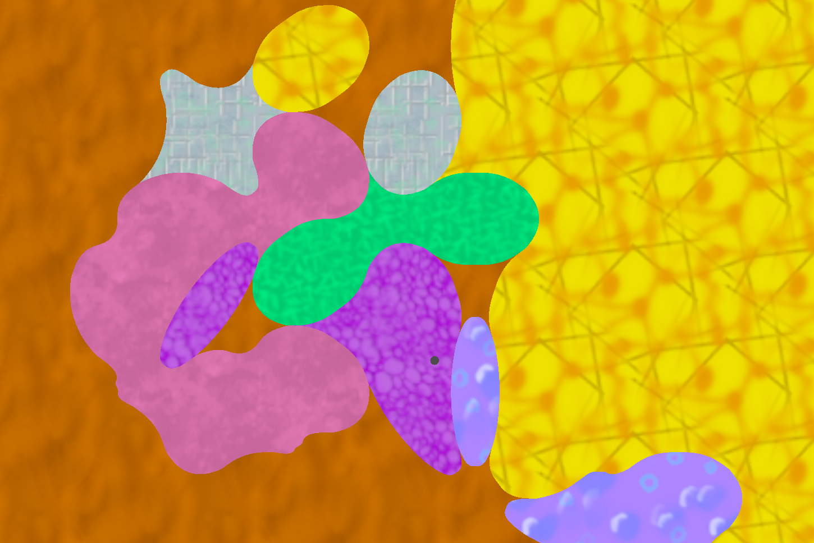
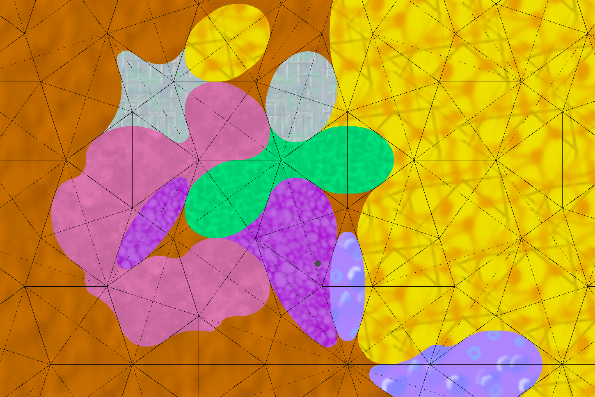
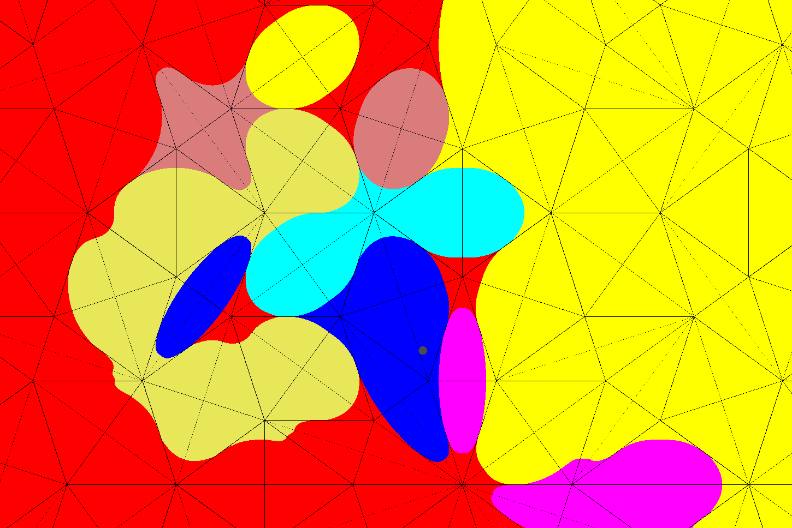
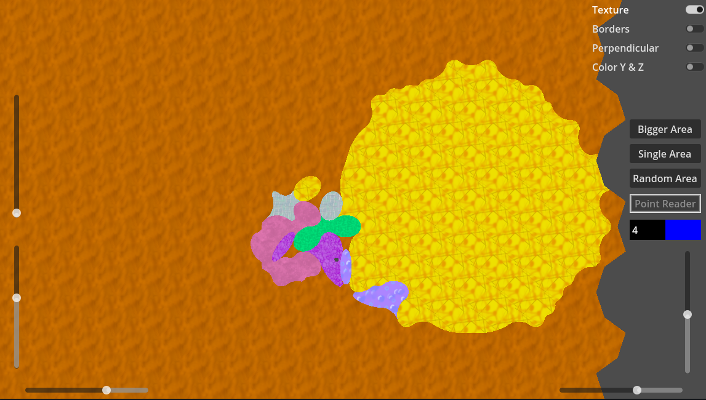

# Penrose-tile-with-Beveling

Penrose tile with Beveling.

Generates tilings, adds type to them and adds curves to eliminate hard edges.

Made with Godot and shaders.

PenroseTile.gdshader is both godot shader and compute shader.

All code is in single file because of static_init/init bug.

## Preview

## Demo usage

Left side contain sliders to control camera position and zoom.
Right side toggles 
* texture or plain color
* border
* perpendicular lines from rhomb center to its opposite side
* Coloring opposite non-center rhomb points.

Right side sliders control position of current area or reader point.
Moving them will change 
* "Bigger area" is big yellow texture area
* "Single area" is small radius of blue texture
* "Random area" is area of random textures, seed is its position
* "Point reader" is single point calculated using compute shader
